# 0 Finance Savings Product Strategic Maze

## Core Insight: "Pure Savings Play"

The most interesting aspect is the **deliberate constraint** - by NOT trying to be a full bank, you become the best at ONE thing that every startup needs.

```mermaid
graph TD
    A[8% Insured Savings Account] --> B[Strategic Positioning]
    A --> C[Market Dynamics]
    A --> D[Product Philosophy]
    A --> E[Growth Mechanics]
    A --> F[Feature Decision Framework]

    B --> B1[Not Competing with Mercury/Brex]
    B --> B2[Complementary Product]
    B --> B3[Single KPI Focus: Yield]
    B --> B4[No Feature Creep]

    B1 --> B1a[Easier Sales: Add alongside existing]
    B1 --> B1b[No switching costs]
    B1 --> B1c[Partners not competitors]

    B2 --> B2a[Mercury for operations]
    B2 --> B2b[0 Finance for idle cash]
    B2 --> B2c[Clear mental model]

    C --> C1[Market Size Paradox]
    C --> C2[Timing Advantage]
    C --> C3[Customer Psychology]

    C1 --> C1a[Smaller TAM but higher penetration]
    C1 --> C1b[100% of startups need savings]
    C1 --> C1c[vs 10% need new bank]

    C2 --> C2a[Post-ZIRP world]
    C2 --> C2b[Startups holding more cash]
    C2 --> C2c[Fewer raises = longer holds]

    C3 --> C3a[Loss aversion: losing to inflation]
    C3 --> C3b[Quantifiable value: extra engineer]
    C3 --> C3c[No behavior change needed]

    D --> D1[Simplicity as Moat]
    D --> D2[Trust Through Focus]
    D --> D3[Anti-Platform Strategy]

    D1 --> D1a[One number to optimize: 8%]
    D1 --> D1b[One promise to keep: insured]
    D1 --> D1c[One customer to serve: startups]

    D2 --> D2a[Do one thing perfectly]
    D2 --> D2b[No distractions]
    D2 --> D2c[Clear value prop]

    E --> E1[Network Effects]
    E --> E2[Viral Mechanics]
    E --> E3[Expansion Strategy]

    E1 --> E1a[CFOs talk to CFOs]
    E1 --> E1b[YC/accelerator clusters]
    E1 --> E1c[Investor recommendations]

    E2 --> E2a[Runway calculator virality]
    E2 --> E2b[Extra hire messaging]
    E2 --> E2c[Public yield dashboard]

    E3 --> E3a[Start with savings]
    E3 --> E3b[Add sweep functionality]
    E3 --> E3c[Eventually: smart treasury]

    F --> F1[The Feature Test]
    F --> F2[What to Build]
    F --> F3[What NOT to Build]

    F1 --> F1a[Does it make us better at 8% insured savings?]
    F1 --> F1b[Does it keep us complementary to banks?]
    F1 --> F1c[Does it maintain our simplicity?]

    F2 --> F2a[Auto-sweep from banks]
    F2 --> F2b[Yield optimization tools]
    F2 --> F2c[Treasury intelligence]
    F2 --> F2d[Withdrawal to any account]

    F3 --> F3a[Debit cards - thats spending]
    F3 --> F3b[Bill pay - thats operations]
    F3 --> F3c[Expense tracking - Brex territory]
    F3 --> F3d[Any spending features]
```



## The "Savings-Only" Strategic Advantages

### 1. **Adoption Velocity**

- **10-minute implementation** vs 2-week bank switch
- **No integration needed** - just ACH money in
- **CFO decision only** - no team training required
- **Reversible decision** - money isn't locked

### 2. **The Anti-Neobank Position**

```
Traditional Neobank Path:
Checking → Cards → Expenses → Payroll → Credit → Kitchen Sink

0 Finance Path:
Savings → More Savings → Best Savings → Only Savings
```

### 3. **Market Segmentation Clarity**

| Startup Stage | Cash Position | 0 Finance Fit | Why                          |
| ------------- | ------------- | ------------- | ---------------------------- |
| Pre-seed      | <$500K        | ❌            | Need operational flexibility |
| Seed          | $1-3M         | ✅✅✅        | Perfect: High idle cash %    |
| Series A      | $5-15M        | ✅✅✅        | Massive yield difference     |
| Series B+     | $20M+         | ✅✅          | Sophisticated treasury needs |
| Profitable    | Variable      | ✅✅✅        | Permanent idle reserves      |

## The Feature Decision Framework

### **The Ultimate Test for Every Feature:**

**"Does this make us better at 8% insured savings?"**

| Feature                          | Build? | Why                         |
| -------------------------------- | ------ | --------------------------- |
| Auto-sweep from Mercury/Brex     | ✅ YES | Maximizes money in savings  |
| Debit card                       | ❌ NO  | That's spending, not saving |
| Treasury analytics               | ✅ YES | Helps optimize savings      |
| Bill pay                         | ❌ NO  | That's operations           |
| Yield alerts                     | ✅ YES | Maximizes savings behavior  |
| Expense tracking                 | ❌ NO  | Brex/Mercury territory      |
| Tax optimization for withdrawals | ✅ YES | Part of smart savings       |
| Corporate cards                  | ❌ NO  | Direct competition trigger  |
| ACH in/out                       | ✅ YES | Core savings functionality  |
| Runway calculator                | ✅ YES | Shows savings value         |

### **The Spending Feature Trap**

```
Adding Spending = Death Spiral

Step 1: Add debit card for "convenience"
Step 2: Now need transaction categorization
Step 3: Now need expense reports
Step 4: Now need receipt capture
Step 5: Now need accounting integration
Step 6: Congratulations, you're building Mercury poorly
Step 7: Mercury adds 1% more yield and kills you
```

## Why Pure Savings Creates a Moat

### **The Partnership Paradox**

By NOT competing, you become partner-able:

- Mercury could add "Move idle cash to 0 Finance" button
- Brex could recommend you for treasury management
- YC could make you the default savings account
- Accounting firms could suggest you without conflict

### **The Competitive Non-Response**

Brex at 4% with full features can't match 8% savings-only:

- Their unit economics break at 8%
- They'd cannibalize their main product
- They'd rather partner than compete

## Product Distillation Strategy

### **Phase 1: Pure Savings (Now)**

```
Features:
- ACH in from any bank
- 8% APY, calculated daily
- FDIC-equivalent insurance
- Simple dashboard showing earnings
- ACH out to any account

That's it. Nothing else.
```

### **Phase 2: Savings Optimization (6 months)**

```
Add ONLY:
- Auto-sweep from connected banks
- "Idle cash alerts"
- Runway impact calculator
- Yield comparison tool
```

### **Phase 3: Treasury Intelligence (12 months)**

```
Add ONLY:
- Multi-bank idle cash detection
- Optimized withdrawal timing (tax)
- Cash flow forecasting for sweeps
- API for accounting software
```

### **NEVER Add:**

- Debit cards
- Credit cards
- Bill pay
- Wire origination (except withdrawals)
- Expense management
- Vendor payments
- Payroll
- Any feature that involves SPENDING

## Go-To-Market Precision

### **The Message Hierarchy**

1. **Hero Number**: 8% (vs 4% everywhere else)
2. **Safety Signal**: Fully insured
3. **Simplicity**: Just savings, nothing else
4. **Social Proof**: $X million from Y startups

### **The Positioning Statement**

"We're not another bank. We're your savings account. Keep Mercury/Brex for operations - they're great at that. We're great at one thing: making your idle cash earn 8%."

## Customer Conversation Framework

### **When they ask for features:**

**"Can you add debit cards?"**

> "We're laser-focused on giving you the highest safe yield. Adding spending features would force us to lower rates. Keep using Mercury for spending - we integrate perfectly with them."

**"What about bill pay?"**

> "That's operations - Mercury and Brex are great at that. We're the savings layer. Connect both for the complete solution."

**"Why can't you be my only bank?"**

> "Because then we'd be mediocre at everything instead of exceptional at savings. You deserve the best checking AND the best savings. We're the latter."

## Revenue Model Without Feature Creep

### **Current: Pure Spread**

```
DeFi Yield: 10-12%
Customer Gets: 8%
0 Finance Keeps: 2-4%
Revenue = AUM × Spread
```

### **Future: Still Pure Spread, Just More**

```
Don't add revenue streams.
Add AUM.
$1B AUM × 3% spread = $30M ARR
No features needed.
```

## The Ultimate Strategic Insight

### **Every unicorn neobank made the same mistake:**

They started with one wedge (checking, cards, etc.) then added everything else, becoming mediocre at all of it.

### **0 Finance's radical discipline:**

Start with savings. End with savings. Win savings.

### **The equation is simple:**

```
Focus = Trust
Trust = Deposits
Deposits = Revenue
Revenue = Success

More Features = Less Focus = Less Trust = Failure
```

## Critical Success Metrics

### **Track ONLY:**

1. AUM growth
2. Average deposit size
3. Customer acquisition cost
4. Yield spread maintained
5. Time to first deposit

### **IGNORE:**

1. Feature requests for spending
2. "Engagement" metrics
3. Transaction volume
4. Daily active users
5. Anything not related to AUM

## The Moat Compounds Over Time

```
Year 1: "That startup with 8% savings"
Year 2: "The default place for idle startup cash"
Year 3: "The Carta of treasury management"
Year 5: "How every company manages savings"
```

## The Counter-Intuitive Truth

**By choosing NOT to add spending features:**

- You avoid competition with Mercury/Brex
- You become partner-able, not threatening
- You maintain simple unit economics
- You keep a clear value proposition
- You build a deeper moat through focus

**The discipline to say NO to features is your entire strategy.**

Every feature that enables spending weakens your position.
Every feature that optimizes savings strengthens it.

This discipline is how you win.
