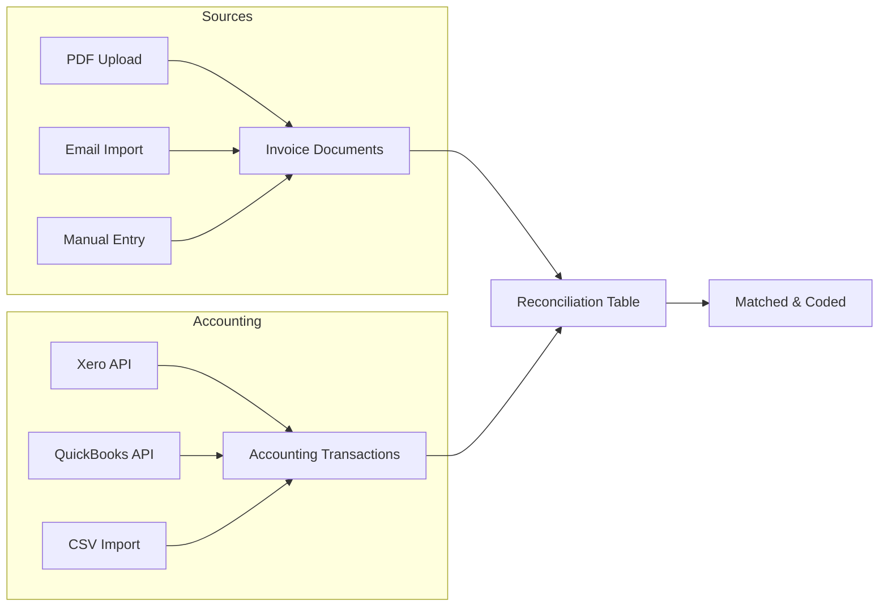

# Invoice Reconciliation System Implementation Plan

## Executive Summary

This document outlines the implementation plan for a comprehensive invoice reconciliation system that bridges document management (inbox cards) with accounting systems (Xero/QuickBooks). The system will enable automated matching, reduce manual errors, and provide a complete audit trail.

## Current State Analysis

### What We Have Now

#### ✅ Working Components

- **Document Upload**: UnifiedDropzone component accepts PDF, PNG, JPG files
- **AI Processing**: Documents are processed through OCR/parsing pipeline
- **Inbox Cards**: Structured storage of invoice data extracted from documents
- **Basic GL Coding**: Manual GL code assignment (local only)
- **CSV Export**: One-way export to QuickBooks format

#### ❌ Missing Components

- No connection to actual accounting systems
- No automatic matching between invoices and transactions
- Manual GL coding not synced back to accounting system
- No reconciliation workflow
- No discrepancy tracking
- CSV import exists but doesn't parse data

### Current Data Flow

```
Document Upload → AI Processing → Inbox Card → Manual Coding → CSV Export
     (PDF/PNG)      (OCR/Parse)     (Storage)   (Local Only)    (One-way)
```

## Proposed System Architecture

### Three-Part Data Model



### Database Schema

#### 1. `accounting_transactions` Table

```sql
- id: UUID (Primary Key)
- userId: String
- source: Enum (xero|quickbooks|manual|bank_feed)
- externalId: String (ID in accounting system)
- transactionType: Enum (invoice|bill_payment|receipt|etc)
- transactionNumber: String (Invoice/Bill number)
- transactionDate: Date
- contactName: String (Vendor)
- totalAmount: Decimal
- status: Enum (draft|submitted|authorised|paid|voided)
- glCode: String
- glAccountName: String
- lineItems: JSONB
- metadata: JSONB
```

#### 2. `invoice_reconciliations` Table

```sql
- id: UUID (Primary Key)
- userId: String
- inboxCardId: String (FK to inbox_cards)
- transactionId: UUID (FK to accounting_transactions)
- matchStatus: Enum (unmatched|suggested|matched|confirmed)
- matchConfidence: Decimal (0-100)
- matchMethod: String (manual|auto_amount|auto_vendor|etc)
- matchedOn: JSONB ({amount: true, vendor: true, ...})
- amountDiscrepancy: Decimal
- dateDiscrepancy: Integer (days)
- glCode: String (can override transaction GL)
- approvalStatus: Enum (pending|approved|rejected)
```

## Implementation Phases

### Phase 1: Foundation (Completed ✅)

- [x] Create database schemas
- [x] Create accounting transactions router
- [x] Create reconciliation router
- [x] Basic CRUD operations

### Phase 2: Import/Export (Current)

- [ ] Enhance CSV import to parse accounting data
- [ ] Create transaction import UI
- [ ] Add validation for imported data
- [ ] Implement bulk import with progress tracking

### Phase 3: Matching Engine

- [ ] Implement intelligent matching algorithm
- [ ] Create suggestion scoring system
- [ ] Add fuzzy matching for vendor names
- [ ] Build confidence scoring

### Phase 4: User Interface

- [ ] Create reconciliation dashboard
- [ ] Add side-by-side comparison view
- [ ] Build bulk action tools
- [ ] Implement drag-and-drop matching

### Phase 5: Integration

- [ ] Xero API integration
- [ ] QuickBooks API integration
- [ ] Webhook for real-time sync
- [ ] Two-way sync capabilities

## Test Data Sets

### 1. Accounting Transactions CSV (From QuickBooks/Xero)

```csv
Date,Transaction Type,Number,Reference,Contact,Description,Total Amount,Tax Amount,Status,GL Code,GL Account,Due Date,Paid Date
2024-01-15,invoice,INV-2024-001,PO-8745,Acme Corporation,Office supplies and equipment,1250.00,125.00,paid,5300,Office Supplies,2024-02-15,2024-02-10
2024-01-18,invoice,INV-2024-002,PO-8746,TechPro Solutions,Monthly software licenses,2500.00,250.00,authorised,5800,Software & Subscriptions,2024-02-18,
2024-01-20,invoice,INV-2024-003,,Global Marketing Inc,Digital marketing campaign Q1,5000.00,500.00,paid,5400,Marketing & Advertising,2024-02-20,2024-02-15
2024-01-22,invoice,INV-2024-004,PO-8750,CloudBase Systems,Cloud hosting services - January,1800.00,180.00,authorised,5800,Software & Subscriptions,2024-02-22,
2024-01-25,invoice,INV-2024-005,,Office Depot,Printer and toner cartridges,450.00,45.00,paid,5300,Office Supplies,2024-02-25,2024-02-20
2024-01-28,invoice,INV-2024-006,PO-8755,Legal Associates LLP,Legal consultation services,3500.00,350.00,authorised,5500,Professional Services,2024-02-28,
2024-02-01,invoice,INV-2024-007,,Fresh Foods Catering,Team lunch catering,850.00,85.00,paid,5700,Travel & Entertainment,2024-03-01,2024-02-25
2024-02-03,invoice,INV-2024-008,PO-8760,SecureNet Insurance,Business liability insurance Q1,2200.00,0.00,paid,5600,Insurance,2024-03-03,2024-02-28
2024-02-05,invoice,INV-2024-009,,TravelCorp,Business travel expenses - February,1650.00,165.00,authorised,5700,Travel & Entertainment,2024-03-05,
2024-02-08,invoice,INV-2024-010,PO-8765,DataAnalytics Pro,Monthly analytics platform subscription,750.00,75.00,paid,5800,Software & Subscriptions,2024-03-08,2024-03-01
```

### 2. Invoice Documents CSV (From Document Processing)

```csv
Invoice Date,Invoice Number,Vendor,Description,Amount,Upload Date,Document Type,Confidence Score
2024-01-15,INV-2024-001,Acme Corp,Office supplies,1250.00,2024-01-16,PDF,95
2024-01-18,INV-2024-002,TechPro Solutions,Software subscription,2500.00,2024-01-19,PDF,92
2024-01-20,2024-003,Global Marketing,Marketing services,5000.00,2024-01-21,PNG,88
2024-01-22,INV-2024-004,CloudBase,Hosting services,1800.00,2024-01-23,PDF,94
2024-01-25,4567,Office Depot,Office equipment,450.00,2024-01-26,JPG,85
2024-01-28,INV-2024-006,Legal Associates,Consultation,3500.00,2024-01-29,PDF,96
2024-02-01,INV-2024-007,Fresh Foods,Catering services,850.00,2024-02-02,PDF,91
2024-02-03,INV-2024-008,SecureNet,Insurance premium,2200.00,2024-02-04,PDF,93
2024-02-05,Travel-0209,TravelCorp,Travel expenses,1650.00,2024-02-06,JPG,87
2024-02-08,INV-2024-010,DataAnalytics Pro,Analytics platform,750.00,2024-02-09,PDF,90
2024-02-10,INV-2024-011,Unmatched Vendor A,Consulting services,1200.00,2024-02-11,PDF,89
2024-02-12,INV-2024-012,Unmatched Vendor B,Equipment rental,800.00,2024-02-13,PNG,86
```

### 3. Expected Matching Results

| Invoice      | Transaction  | Match Score | Match Criteria            | Action Required    |
| ------------ | ------------ | ----------- | ------------------------- | ------------------ |
| INV-2024-001 | INV-2024-001 | 100%        | ✅ Number, Amount, Vendor | Auto-match         |
| INV-2024-002 | INV-2024-002 | 100%        | ✅ Number, Amount, Vendor | Auto-match         |
| 2024-003     | INV-2024-003 | 85%         | ✅ Amount, Vendor, Date   | Review prefix      |
| INV-2024-004 | INV-2024-004 | 95%         | ✅ Number, Amount         | Confirm vendor     |
| 4567         | INV-2024-005 | 70%         | ✅ Amount, Vendor         | Manual review      |
| INV-2024-011 | -            | 0%          | No match                  | Create transaction |
| INV-2024-012 | -            | 0%          | No match                  | Create transaction |

## Matching Algorithm

### Scoring System (Total: 100 points)

```javascript
function calculateMatchScore(invoice, transaction) {
  let score = 0;

  // Invoice Number Match (30 points)
  if (invoice.number === transaction.number) {
    score += 30;
  } else if (fuzzyMatch(invoice.number, transaction.number) > 0.8) {
    score += 15;
  }

  // Amount Match (40 points)
  const amountDiff = Math.abs(invoice.amount - transaction.amount);
  const tolerance = invoice.amount * 0.01; // 1% tolerance

  if (amountDiff === 0) {
    score += 40;
  } else if (amountDiff <= tolerance) {
    score += 30;
  } else if (amountDiff <= invoice.amount * 0.05) {
    score += 15;
  }

  // Vendor Match (20 points)
  if (invoice.vendor === transaction.contact) {
    score += 20;
  } else if (fuzzyMatch(invoice.vendor, transaction.contact) > 0.7) {
    score += 10;
  }

  // Date Proximity (10 points)
  const daysDiff = Math.abs(dateDiff(invoice.date, transaction.date));
  if (daysDiff <= 3) {
    score += 10;
  } else if (daysDiff <= 7) {
    score += 5;
  }

  return score;
}
```

### Match Thresholds

- **90-100%**: Auto-match (high confidence)
- **70-89%**: Suggested match (review recommended)
- **50-69%**: Possible match (manual review required)
- **< 50%**: No match suggested

## User Interface Design

### Reconciliation Dashboard

```
┌─────────────────────────────────────────────────────────────┐
│  Invoice Reconciliation                    [Import] [Export] │
├─────────────────────────────────────────────────────────────┤
│                                                              │
│  Summary                                                     │
│  ┌──────────┬──────────┬──────────┬──────────┐            │
│  │ Unmatched│ Suggested│ Matched  │ Confirmed│            │
│  │    12    │    8     │    45    │    102   │            │
│  └──────────┴──────────┴──────────┴──────────┘            │
│                                                              │
│  ┌─── Invoices ───┐          ┌─── Transactions ───┐        │
│  │                 │ <------> │                    │        │
│  │ INV-2024-001   │          │ INV-2024-001      │        │
│  │ $1,250.00      │  Match   │ $1,250.00         │        │
│  │ Acme Corp      │   95%    │ Acme Corporation  │        │
│  │                 │          │                    │        │
│  └─────────────────┘          └────────────────────┘        │
│                                                              │
│  [Confirm Match] [Reject] [Find Alternative]                │
└─────────────────────────────────────────────────────────────┘
```

### Bulk Actions View

```
┌─────────────────────────────────────────────────────────────┐
│  Bulk Reconciliation                    Selected: 15 items  │
├─────────────────────────────────────────────────────────────┤
│                                                              │
│  [✓] Select All  [Auto-match High Confidence] [Export]      │
│                                                              │
│  ┌─┬──────────────┬──────────┬──────────┬─────────────┐   │
│  │✓│ Invoice      │ Match    │ Score    │ Action      │   │
│  ├─┼──────────────┼──────────┼──────────┼─────────────┤   │
│  │✓│ INV-2024-001│ Found    │ 100%     │ Auto-match  │   │
│  │✓│ INV-2024-002│ Found    │ 95%      │ Review      │   │
│  │ │ INV-2024-003│ Multiple │ 85%, 82% │ Choose      │   │
│  │✓│ INV-2024-004│ Not found│ -        │ Create      │   │
│  └─┴──────────────┴──────────┴──────────┴─────────────┘   │
│                                                              │
│  [Apply GL Code] [Approve Selected] [Reject Selected]       │
└─────────────────────────────────────────────────────────────┘
```

## Implementation Steps

### Step 1: Enhance CSV Import (Priority: High)

```typescript
// Update handleCSVImport in inbox-v2/page.tsx
const handleCSVImport = async (file: File) => {
  const text = await file.text();
  const lines = text.split('\n');
  const headers = lines[0].split(',');

  const transactions = [];
  for (let i = 1; i < lines.length; i++) {
    const values = parseCSVLine(lines[i]);
    const transaction = mapToTransaction(headers, values);
    transactions.push(transaction);
  }

  // Call API to bulk create transactions
  await syncTransactionsMutation.mutate({
    source: 'quickbooks',
    transactions,
  });
};
```

### Step 2: Create Matching UI Component

```typescript
// New component: MatchingView.tsx
interface MatchingViewProps {
  invoice: InboxCard;
  suggestions: TransactionMatch[];
  onMatch: (transactionId: string) => void;
  onReject: () => void;
}

export function MatchingView({ invoice, suggestions, onMatch, onReject }) {
  return (
    <div className="grid grid-cols-2 gap-4">
      <InvoiceCard invoice={invoice} />
      <div className="space-y-2">
        {suggestions.map(suggestion => (
          <TransactionCard
            key={suggestion.id}
            transaction={suggestion.transaction}
            score={suggestion.score}
            onSelect={() => onMatch(suggestion.transaction.id)}
          />
        ))}
      </div>
    </div>
  );
}
```

### Step 3: Add Reconciliation Tab

```typescript
// Add to inbox-v2/page.tsx
<Tabs>
  <TabsList>
    <TabsTrigger value="pending">Pending Coding</TabsTrigger>
    <TabsTrigger value="reconciliation">Reconciliation</TabsTrigger>
    <TabsTrigger value="matched">Matched</TabsTrigger>
  </TabsList>

  <TabsContent value="reconciliation">
    <ReconciliationView
      invoices={unMatchedInvoices}
      transactions={unmatchedTransactions}
      onMatch={handleMatch}
    />
  </TabsContent>
</Tabs>
```

## Testing Strategy

### 1. Unit Tests

- Matching algorithm accuracy
- Score calculation
- CSV parsing
- Data validation

### 2. Integration Tests

- End-to-end import flow
- Matching workflow
- Export functionality
- API endpoints

### 3. User Acceptance Tests

- Upload 10 sample invoices
- Import 10 accounting transactions
- Verify 8 successful auto-matches
- Manually match 2 remaining items
- Export reconciled data
- Verify GL codes preserved

## Success Metrics

### Quantitative

- **Match Accuracy**: > 90% for high-confidence matches
- **Time Savings**: 75% reduction in manual reconciliation time
- **Error Rate**: < 2% false positive matches
- **Processing Speed**: < 2 seconds per match calculation

### Qualitative

- User satisfaction with matching suggestions
- Ease of bulk operations
- Clarity of discrepancy reporting
- Confidence in automated matches

## Risk Mitigation

### Data Integrity

- Always maintain audit trail
- Never auto-match below 90% confidence
- Require manual approval for GL code changes
- Implement rollback capabilities

### Performance

- Implement pagination for large datasets
- Use database indexes on match fields
- Cache matching calculations
- Batch process bulk operations

### Security

- Validate all CSV inputs
- Sanitize data before storage
- Implement rate limiting
- Audit log all reconciliation actions

## Timeline

### Week 1-2: Import/Export Enhancement

- Enhance CSV parser
- Add validation
- Create import UI
- Test with sample data

### Week 3-4: Matching Engine

- Implement scoring algorithm
- Add fuzzy matching
- Create suggestion system
- Optimize performance

### Week 5-6: User Interface

- Build reconciliation dashboard
- Add comparison views
- Implement bulk actions
- Create approval workflow

### Week 7-8: Testing & Refinement

- Run test scenarios
- Fix bugs
- Optimize UX
- Document features

## Next Steps

1. **Immediate Actions**

   - Review and approve this plan
   - Set up test environment
   - Create sample data sets
   - Begin CSV import enhancement

2. **Technical Preparation**

   - Set up database migrations
   - Configure test accounts
   - Prepare API endpoints
   - Design UI mockups

3. **Team Alignment**
   - Review with stakeholders
   - Assign responsibilities
   - Set up tracking
   - Schedule check-ins

## Appendix

### A. Database Migration Scripts

```sql
-- Create accounting_transactions table
CREATE TABLE accounting_transactions (
  -- Schema as defined above
);

-- Create invoice_reconciliations table
CREATE TABLE invoice_reconciliations (
  -- Schema as defined above
);

-- Add indexes for performance
CREATE INDEX idx_transactions_user_date ON accounting_transactions(userId, transactionDate);
CREATE INDEX idx_reconciliations_status ON invoice_reconciliations(matchStatus);
```

### B. API Endpoints

```typescript
// New endpoints to implement
POST   /api/accounting/import          // Bulk import transactions
GET    /api/reconciliation/suggestions // Get match suggestions
POST   /api/reconciliation/match      // Create a match
DELETE /api/reconciliation/match/:id  // Remove a match
POST   /api/reconciliation/bulk       // Bulk reconciliation
GET    /api/reconciliation/export     // Export reconciled data
```

### C. Sample API Responses

```json
// GET /api/reconciliation/suggestions
{
  "invoice": {
    "id": "inv_123",
    "number": "INV-2024-001",
    "amount": 1250.0,
    "vendor": "Acme Corp"
  },
  "suggestions": [
    {
      "transaction": {
        "id": "txn_456",
        "number": "INV-2024-001",
        "amount": 1250.0,
        "contact": "Acme Corporation"
      },
      "score": 95,
      "confidence": "high",
      "matchCriteria": {
        "amount": true,
        "vendor": true,
        "invoiceNumber": true,
        "date": true
      }
    }
  ]
}
```

---

_This document serves as the comprehensive implementation plan for the invoice reconciliation system. It should be reviewed and updated as the project progresses._
